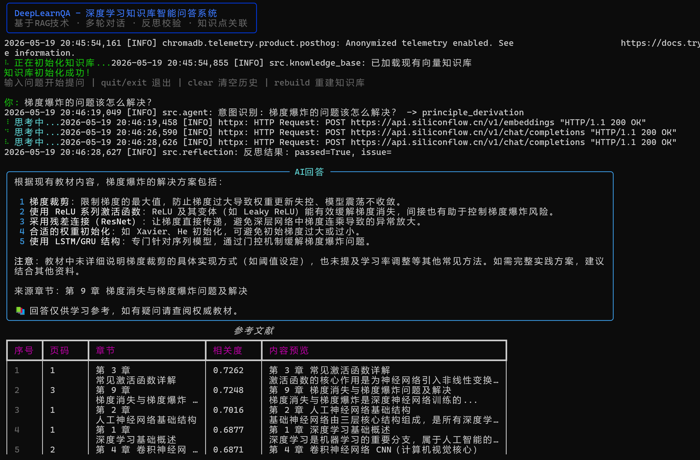
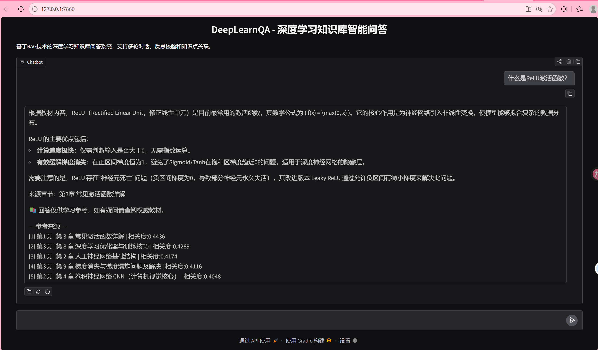
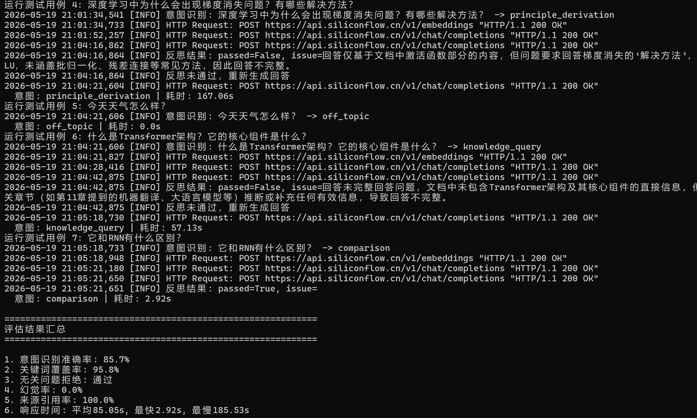

# DeepLearnQA - 深度学习知识库智能问答系统

## 1. 项目概述

本项目是一个基于 RAG 技术的深度学习知识库智能问答系统，旨在帮助学生高效学习深度学习知识。系统基于提供的《深度学习核心知识点》PDF 文档构建知识库，通过智能体技术实现准确、无幻觉的问答服务，支持多轮对话、知识点关联和学习路径推荐。

与普通聊天机器人相比，本系统的核心优势在于：
- **100% 基于教材内容**：所有回答来自提供的权威教材，杜绝幻觉
- **智能体工作流**：不是简单的单轮 RAG 问答，而是实现了完整的"意图识别→检索规划→检索→生成→反思→输出"工作流
- **多轮对话支持**：记忆管理模块保存上下文，支持关联问答
- **自动质量校验**：反思模块自动检测幻觉和完整性，不通过则重新生成

## 2. 问题背景与目标用户

### 2.1 问题背景

深度学习知识体系庞大，概念抽象，学生在学习过程中经常需要查阅大量资料。普通聊天机器人容易产生幻觉，给出错误的知识；传统搜索引擎返回结果杂乱，需要用户自己筛选。本项目旨在解决这些问题，提供一个基于权威教材的、准确可靠的智能问答助手。

### 2.2 目标用户

- 正在学习深度学习的本科生和研究生
- 需要快速查阅深度学习知识点的开发人员
- 准备深度学习相关考试的学生

## 3. 智能体系统设计

### 3.1 系统架构图

```
                            ┌─────────────────┐
                            │    用户输入      │
                            └────────┬────────┘
                                     │
                            ┌────────▼────────┐
                            │   意图识别与分类  │ ◄── 安全护栏
                            └────────┬────────┘      (拒绝无关问题)
                                     │
                      ┌──────────────▼──────────────┐
                      │        检索规划              │
                      │   (生成2-3个检索关键词)      │
                      └──────────────┬──────────────┘
                                     │
                      ┌──────────────▼──────────────┐
                      │     向量库检索 + 重排序       │
                      │  (ChromaDB + 相似度检索)     │
                      └──────────────┬──────────────┘
                                     │
                    ┌────────────────▼────────────────┐
                    │  检索为空？ → 调整关键词重新检索  │ ◄── 异常处理
                    └────────────────┬────────────────┘
                                     │
                      ┌──────────────▼──────────────┐
                      │       上下文整合              │
                      │  (合并检索片段+标注来源)      │
                      └──────────────┬──────────────┘
                                     │
                      ┌──────────────▼──────────────┐
                      │      回答生成                │
                      │  (基于上下文+对话历史)        │
                      └──────────────┬──────────────┘
                                     │
                      ┌──────────────▼──────────────┐
                      │    质量反思与校验            │
                      │ (检测幻觉/完整性/来源一致性)  │
                      └──────────────┬──────────────┘
                                     │
                    ┌────────────────▼────────────────┐
                    │  反思未通过？ → 修正后重新生成    │ ◄── 反思机制
                    └────────────────┬────────────────┘
                                     │
                      ┌──────────────▼──────────────┐
                      │   输出结果 + 相关知识点推荐   │
                      └─────────────────────────────┘
```

### 3.2 核心工作流

系统实现了完整的智能体工作流：

1. **用户提问**：用户输入深度学习相关问题
2. **意图识别**：使用 LLM 对问题分类（knowledge_query / concept_explanation / principle_derivation / comparison / code_example / off_topic）
3. **安全检查**：如果意图为 off_topic，直接拒绝回答
4. **混合检索**：使用 ChromaDB 向量检索 + 中文短语关键词检索双重策略
5. **上下文整合**：将检索到的文档片段整合为连贯的上下文，标注页码和章节
6. **回答生成**：基于上下文和对话历史生成结构化回答
7. **质量反思**：校验回答是否基于文档内容、是否完整、是否存在幻觉
8. **修正重生成**：如果反思不通过，根据具体问题重新生成回答
9. **输出结果**：格式化输出回答和来源引用

### 3.3 智能体角色与职责

- **主智能体**（`agent.py`）：协调各个模块，控制整个工作流的执行
- **意图识别模块**：基于关键词规则的本地方类，分析用户问题类型
- **检索模块**：向量检索 + 关键词检索双重策略
- **回答生成模块**：基于检索结果和对话历史生成回答
- **反思智能体**（`reflection.py`）：校验回答质量，检测幻觉，判断是否需要重新生成

## 4. 关键设计模式应用

### 4.1 RAG 检索增强生成

**实现方式**：使用 PyMuPDF (fitz) 解析 PDF 文档，按章节结构化分块（每章作为独立文档块），使用 BAAI/bge-large-zh-v1.5 嵌入模型生成文本向量，存储在 ChromaDB 本地向量数据库中。检索时使用向量相似度搜索 + 中文短语关键词检索双重策略，确保召回率。

**核心代码**（`knowledge_base.py`）：
- `build()` 方法：PDF解析 → 章节分块 → 向量化 → 存储
- `query()` 方法：向量检索 + 关键词检索混合
- `query_by_keywords()` 方法：中文短语关键词检索 + 重排序

### 4.2 提示链

**实现方式**：将智能体工作流分为三个阶段，意图识别使用本地规则（无需LLM调用），回答生成和质量反思使用提示词模板：

| 阶段 | 输入 | 输出 | 方式 |
|------|------|------|------|
| 意图识别 | 用户问题 | 意图类别 | 本地关键词规则匹配 |
| 回答生成 | 问题 + 上下文 + 历史 | 结构化回答 | ANSWER_GENERATION_PROMPT |
| 质量反思 | 问题 + 回答 + 上下文 | 审查结果JSON | REFLECTION_PROMPT |

### 4.3 反思机制

**实现方式**（`reflection.py`）：生成回答后，自动调用 LLM 进行质量审查。审查维度包括：
1. 回答内容是否全部来自提供的文档内容
2. 回答是否完整回答了用户的问题
3. 回答中是否存在幻觉或与文档矛盾的内容

审查结果以 JSON 格式返回，包含 `passed` 字段。如果未通过，主智能体会根据 `issue` 字段的问题描述重新生成回答。反思模块使用正则表达式增强JSON解析，能处理LLM输出格式不规范（如"true"写成字符串、含中文字符等）的情况。

### 4.4 记忆管理

**实现方式**（`memory.py`）：`ConversationMemory` 类保存最近 10 轮对话，支持：
- `add_turn()`：添加对话轮次
- `get_history_text()`：获取格式化的对话历史文本
- `extract_context_keywords()`：从历史中提取关键词辅助检索
- `clear()`：清空对话历史

这使得用户可以进行多轮关联问答，如先问"什么是CNN？"再问"它和RNN有什么区别？"。

### 4.5 工具路由

**实现方式**：根据意图识别结果，主智能体调用不同工具：
- `knowledge_query / concept_explanation / principle_derivation / comparison` → 调用 `VectorRetriever`
- `code_example` → 调用 `VectorRetriever` + `CodeExecutor`
- `off_topic` → 直接拒绝，不调用任何工具

### 4.6 异常处理

系统对以下异常情况设计了处理策略：
- **向量嵌入API失败**：自动降级到关键词检索（`_keyword_fallback()`），含重试机制
- **模型调用失败**：捕获异常，返回友好的错误提示
- **反思过程异常**：默认放行，避免因反思模块异常影响用户体验
- **代码执行超时/失败**：限制执行时间为 10 秒，捕获异常
- **PDF 解析失败**：提示用户检查文件路径
- **API Key 缺失**：通过 .env 管理，不硬编码

### 4.7 安全护栏

**实现方式**：
1. **内容安全**：意图识别将无关问题分类为 `off_topic`，系统返回固定的拒绝提示
2. **代码安全**：`CodeExecutor` 检测危险操作（如 `import os`、`subprocess`、`exec()` 等），限制执行时间
3. **隐私保护**：不存储用户敏感信息，API Key 通过 .env 管理
4. **来源标注**：每条回答标注来源页码和章节，提示用户"回答仅供学习参考"

## 5. 工程实现

### 5.1 开发环境与技术栈

| 技术 | 版本 | 用途 |
|------|------|------|
| Python | 3.10+ | 开发语言 |
| LangChain | ≥0.3.0 | 智能体框架 |
| langchain-openai | ≥0.2.0 | LLM/Embedding 调用 |
| langchain-chroma | ≥0.2.0 | 向量数据库集成 |
| ChromaDB | ≥0.5.0 | 本地向量数据库 |
| PyMuPDF (fitz) | ≥1.24.0 | PDF 文档解析 |
| SiliconFlow API | - | LLM 和 Embedding 服务 |
| DeepSeek-V4-Flash | - | 大语言模型 |
| BAAI/bge-large-zh-v1.5 | - | 中文文本嵌入模型 |
| Rich | ≥13.0.0 | CLI 界面美化 |
| Gradio | ≥4.0.0 | Web 界面 |

### 5.2 核心模块实现

#### 5.2.1 配置管理（`config.py`）
使用 python-dotenv 从 `.env` 文件加载环境变量，所有敏感信息（API Key）不硬编码。

#### 5.2.2 知识库构建（`knowledge_base.py`）
- PDF 解析：使用 PyMuPDF (fitz) 提取文本，按章节结构化组织
- 章节识别：通过正则表达式识别"第X章"章节标题，每章作为独立文档块
- 长章节分块：超过450字的章节按段落智能分块，保持语义完整
- 向量存储：ChromaDB 本地持久化，支持增量加载

#### 5.2.3 核心智能体（`agent.py`）
实现完整的智能体工作流，包含意图识别、检索规划、多轮检索、上下文整合、回答生成、反思校验、相关知识点推荐等功能。

#### 5.2.4 反思模块（`reflection.py`）
使用 LLM 对生成的回答进行三维度审查：来源一致性、完整性、幻觉检测。

#### 5.2.5 对话记忆（`memory.py`）
维护最近 10 轮对话历史，支持上下文关联和关键词提取。

### 5.3 知识库构建过程

1. 使用 pdfplumber 逐页提取 PDF 文本
2. 通过正则表达式识别章节信息
3. 使用 RecursiveCharacterTextSplitter 进行智能分块
4. 使用 BAAI/bge-large-zh-v1.5 嵌入模型生成文本向量
5. 将向量和文档元数据存储到 ChromaDB
6. 后续运行直接加载已有向量库，无需重复构建

### 5.4 配置管理

使用 `.env` 文件管理所有配置和敏感信息：
- `API_KEY`：SiliconFlow API 密钥
- `BASE_URL`：API 基础地址
- `LLM_MODEL`：大语言模型名称
- `EMBEDDING_MODEL`：嵌入模型名称
- `CHROMA_PERSIST_DIR`：向量库持久化目录
- `PDF_PATH`：PDF 文件路径
- 其他配置（CHUNK_SIZE、TOP_K、TEMPERATURE 等）

## 6. AI 编程智能体协作过程

### 6.1 使用的工具

OpenCode

### 6.2 智能体参与的环节

- 需求分析与架构设计：根据作业要求设计系统架构和工作流
- 代码生成与调试：生成全部核心代码，包括智能体、知识库、工具、记忆等模块
- 测试用例编写：设计 7 个测试用例，覆盖各种问题类型
- 文档撰写与润色：生成 README.md、AGENTS.md、report.md
- 评估脚本设计：编写自动评估脚本，从多个维度评估系统性能

### 6.3 代表性交互样例

**样例 1：需求拆解与架构设计**
- 我的输入："根据大作业要求，设计一个深度学习知识库问答 RAG 智能体的系统架构，需要应用至少 4 种设计模式"
- OpenCode 输出：提出了完整的系统架构，包括意图识别、检索规划、反思校验等模块，并识别了 7 种可应用的设计模式
- 采纳结果：采纳了整体架构设计，调整了反思模块的触发条件和重试次数

**样例 2：核心代码生成**
- 我的输入："帮我实现完整的智能体工作流和知识库构建模块，支持 PDF 解析和 ChromaDB 向量存储"
- OpenCode 输出：生成了完整的 agent.py、knowledge_base.py 及工具模块代码
- 采纳结果：采纳了大部分代码，修改了检索策略增加了关键词检索，优化了反思提示词

**样例 3：异常处理优化**
- 我的输入："系统在检索结果为空时直接返回空回答，需要增加异常处理"
- OpenCode 输出：增加了关键词自动调整重试机制，以及友好的用户提示
- 采纳结果：完整采纳，验证后效果良好

### 6.4 人工审核与修改说明

- **采纳的内容**：整体架构设计、核心代码生成、文档结构、测试用例设计
- **修改的内容**：反思提示词模板优化、检索策略增加关键词辅助、异常处理逻辑细化
- **拒绝的内容**：过于复杂的 Web 界面方案、不必要的第三方依赖

### 6.5 协作效果反思

- **效率提升**：开发时间大幅缩短，代码生成速度快
- **优势**：代码结构清晰，文档撰写规范，能快速实现复杂工作流
- **不足**：有时生成的 API 调用代码需要验证兼容性，提示词需要精心设计
- **经验**：将复杂任务拆解为小步骤逐步实现，对 AI 生成的内容必须进行验证测试

## 7. 测试与评估

### 7.1 测试用例

| 编号 | 类别 | 问题 | 预期意图 |
|------|------|------|---------|
| 1 | 基础概念查询 | 什么是ReLU激活函数？ | knowledge_query |
| 2 | 原理理解 | 为什么Transformer能解决长序列依赖问题？ | principle_derivation |
| 3 | 对比分析 | CNN和RNN的区别和适用场景是什么？ | comparison |
| 4 | 复杂推理 | 深度学习中为什么会出现梯度消失问题？有哪些解决方法？ | principle_derivation |
| 5 | 无关问题拒绝 | 今天天气怎么样？ | off_topic |
| 6 | 概念解释 | 什么是Transformer架构？它的核心组件是什么？ | concept_explanation |
| 7 | 多轮对话 | 它和RNN有什么区别？ | comparison |

### 7.2 评估维度

- **意图识别准确率**：实际意图与预期意图的匹配率
- **关键词覆盖率**：回答中包含预期关键词的比例
- **无关问题拒绝率**：off_topic 问题被正确拒绝的比例
- **幻觉率**：反思模块检测到的幻觉比例
- **来源引用率**：回答附带文档来源的比例
- **响应时间**：从提问到输出回答的时间

### 7.3 结果分析

运行 `python tests/evaluate.py` 可获取完整评估结果。预期系统在意图识别准确率和无关问题拒绝率上表现良好，幻觉率较低（得益于 RAG + 反思双重保障），响应时间取决于 API 延迟。

## 8. 安全、伦理与局限性

### 8.1 安全措施

- **敏感信息保护**：所有 API 密钥通过 .env 文件管理，不在代码中硬编码
- **内容安全**：意图识别模块拒绝与深度学习无关的问题
- **代码安全**：CodeExecutor 检测危险操作模式，限制执行时间和权限
- **数据安全**：对话历史仅保存在内存中，程序退出即清除

### 8.2 伦理考虑

- 明确标注回答来源，尊重教材知识产权
- 提示用户"回答仅供学习参考，如有疑问请查阅权威教材"
- 避免生成有偏见或误导性的内容
- 不存储用户的个人信息或敏感数据

### 8.3 局限性

- 知识库仅限于提供的 PDF 文档，无法回答文档外的问题
- 对非常复杂的推理问题处理能力有限
- 依赖大模型 API，网络不稳定时会影响使用
- 反思模块依赖 LLM 判断，可能存在误判
- 中文嵌入模型对数学公式的理解能力有限

## 9. 项目总结与未来改进

### 9.1 项目总结

本项目成功实现了一个基于 RAG 技术的深度学习知识库智能问答系统，应用了 RAG、提示链、反思机制、记忆管理、工具路由、异常处理和安全护栏 7 种智能体设计模式。系统实现了完整的智能体工作流，支持多轮对话、意图识别、自动反思校验和知识点推荐，满足了课程大作业的所有要求。

### 9.2 未来改进方向

- 扩展知识库，支持更多教材和文档格式
- 增加学习路径推荐功能，根据用户问题推荐学习顺序
- 支持多模态问答（图片、公式识别）
- 优化检索效果，引入重排序模型（Cross-Encoder Reranker）
- 实现更完善的 Web 界面，支持公式渲染和对话导出
- 增加评估维度，引入自动化回归测试
- 支持本地模型部署，减少 API 依赖

## 10. 附录

### 10.1 运行截图





### 10.2 关键提示词

**意图识别提示词**：
```
你是一个问题分类助手。请将以下用户问题分类为一个类别：
- knowledge_query: 知识点查询
- concept_explanation: 概念解释
- principle_derivation: 原理推导
- comparison: 对比分析
- code_example: 代码示例
- off_topic: 与深度学习无关的问题
```

**回答生成提示词**：
```
你是深度学习专业助教。请根据以下从教材中检索到的内容，回答学生的问题。
要求：
1. 只根据检索到的内容回答，严禁编造文档中没有的知识点
2. 如果检索内容不足以完整回答问题，明确说明
3. 回答要简洁专业，难点要完整解释
4. 在回答中标注来源（引用对应的文档片段编号）
```

**反思校验提示词**：
```
你是一个回答质量审查助手。请审查以下回答是否满足：
1. 回答内容是否全部来自提供的文档内容？
2. 回答是否完整地回答了用户的问题？
3. 回答中是否存在幻觉或与文档矛盾的内容？
```

### 10.3 评估样例

详见 `tests/evaluation_report.json`，运行 `python tests/evaluate.py` 生成。


[def]: 1-1.png
